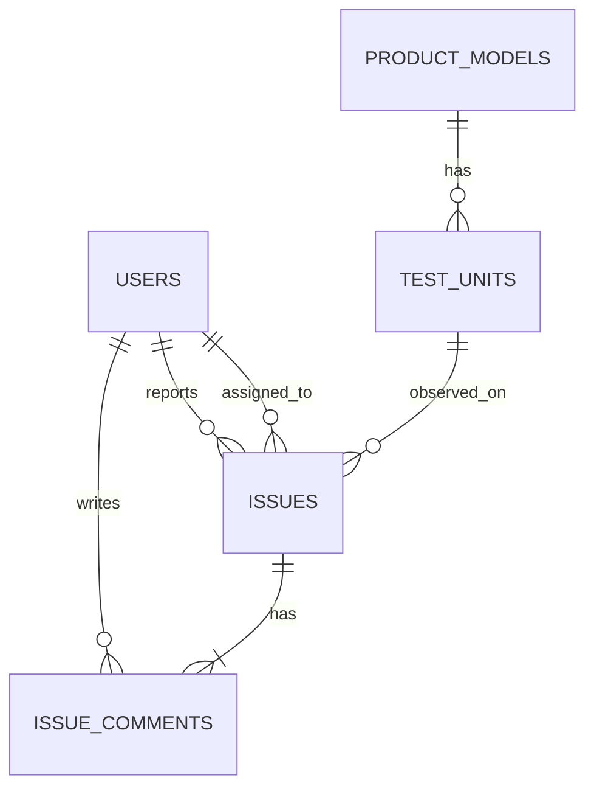
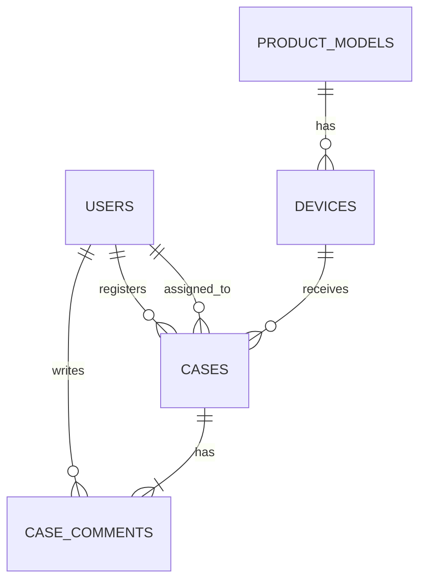

# Query Man MVP

Status: Question-scoped metadata API implemented

## Objective

서로 다른 업무 의미와 schema를 가진 두 PostgreSQL source를 하나의 gateway 계약으로
조회할 수 있는지 검증한다.

| Source ID | Database | Purpose |
|---|---|---|
| `development-issues` | `development_issues` | 개발 및 검증 과정에서 발견한 문제, 원인, 대책, 댓글 조회 |
| `market-voc` | `market_voc` | 시장 VOC, 제품 모델, 시리얼, HW/SW version과 처리 이력 조회 |

`query_man` database는 향후 source registry와 정책을 저장할 control plane으로
남겨둔다. Query 한 번은 정확히 한 source만 대상으로 하며 두 source 사이의 SQL
join은 MVP 범위에 포함하지 않는다.

## Development Issues Source



Source schema는 `development`이고 AI reader에는 다음 `ai` view만 공개한다.

| View | Grain | Role |
|---|---|---|
| `ai.issue_overview` | 개발 문제 1건 | 날짜, 사용자 ID, 제목, 문제 상세, 원인, 대책, 모델, 시리얼, 관측 HW/SW, 댓글 수 |
| `ai.issue_comments` | 댓글 1건 | 문제별 댓글 본문, 작성자, 댓글 시각 |
| `ai.test_unit_overview` | 시험기 1대 | 문제 없는 시험기를 포함한 시험기 분모와 문제 건수 |

Seed는 사용자 18명, 제품 모델 6개, 시험기 160대, 개발 문제 600건, 댓글
1,500건이다. 모든 개발 문제에는 1~4개의 댓글이 있고, 분석 전 상태에서는 원인과
대책이 null이다.

## Market VOC Source



Source schema는 `voc`이고 AI reader에는 다음 `ai` view만 공개한다.

| View | Grain | Role |
|---|---|---|
| `ai.voc_overview` | VOC 1건 | 시장 접수 정보, 증상, 원인, 대응, 모델, 시리얼, 관측 HW/SW, 댓글 수 |
| `ai.voc_comments` | 댓글 1건 | 내부/고객 공개 댓글, 작성자, 댓글 시각 |
| `ai.device_overview` | 판매 기기 1대 | VOC가 없는 기기를 포함한 기기 분모와 VOC 건수 |

Seed는 사용자 24명, 제품 모델 8개, 판매 기기 400대, VOC 1,200건, 댓글
3,000건이다. 다음 관계를 의도적으로 포함한다.

- VOC가 없는 기기 40대
- 힌지 VOC는 `NURI` 제품군에만 존재
- `BORA-LITE-1`의 특정 제조 lot에 배터리/과열 사례 집중
- 최근 접수 건일수록 미해결 상태 비율이 높음
- reporter, assignee, comment author가 같은 사용자 table을 서로 다른 역할로 참조

## Why Multiple Query Surfaces

문제와 댓글을 하나의 평면 view로 합치면 댓글 수만큼 문제 행이 복제된다. 문제 건수,
기기 수와 댓글 수를 함께 집계할 때 fanout 오류가 발생한다.

따라서 relation마다 grain을 고정한다.

```text
issue_overview       = one row per issue
issue_comments       = one row per issue comment
test_unit_overview   = one row per test unit

voc_overview         = one row per VOC case
voc_comments         = one row per VOC comment
device_overview      = one row per sold device
```

View와 column의 `COMMENT ON` metadata에는 grain, 시간 의미, nullable 의미와 안전한
join key를 기록한다. `get_context`는 이 metadata를 그대로 전체 반환하지 않고 질문과
관련된 view만 선택해야 한다.

## Provisional MCP Contract

```text
list_sources()
  -> source_id, description

get_context(source_id, question)
  -> metadata_revision, relevant_views, columns, grains, join_hints

query(source_id, sql, metadata_revision)
  -> status, reason_code, columns, rows, truncated, query_id
```

MVP의 source registry는 다음 두 항목을 정적으로 등록하는 것으로 시작한다.

```yaml
- source_id: development-issues
  database: development_issues
  role: development_issues_reader
  allowed_schema: ai
  budget_profile: interactive

- source_id: market-voc
  database: market_voc
  role: market_voc_reader
  allowed_schema: ai
  budget_profile: interactive
```

Client는 DSN이나 role을 선택하지 않고 opaque `source_id`만 전달한다.

현재 HTTP MVP는 위 계약의 `list_sources`와 `get_context`를 각각 `GET /sources`,
`POST /meta`로 제공한다. `/meta` 요청 예시는 다음과 같다.

```json
{
  "source_id": "market-voc",
  "question": "VOC가 한 번도 없는 기기는 몇 대인가?",
  "max_objects": 2
}
```

응답은 `metadata_revision`, `answerability`, 선택된 relation과 전체 column, grain,
기본 시간 column, measure, value hint, source별 business predicate, 승인된 join과
composition/fanout 경고를 포함한다. PostgreSQL view의 nullability는 catalog에서
정확히 전파되지 않으므로 추측하지 않고 `"unknown"`으로 반환한다.

`answerability`는 SQL 정답을 보증하지 않고 `best_effort`, `low_confidence`,
`needs_clarification`, `unsupported` 중 하나를 반환한다. 예를 들어 시장 VOC의 미해결은
`status NOT IN ('RESOLVED', 'CLOSED')`, 개발 문제의 미해결은
`status <> 'RESOLVED'`라는 서로 다른 predicate로 전달한다.

## Reader Safety Baseline

각 source는 별도 login role을 사용한다.

- 자기 source database에만 `CONNECT`
- 원천 schema 권한 없음
- `ai` view에만 `SELECT`
- `default_transaction_read_only=on`
- `statement_timeout=5s`, `lock_timeout=250ms`, `transaction_timeout=8s`
- `work_mem=8MB`, `temp_file_limit=64MB`
- parallel gather 비활성화, JIT 비활성화, connection limit 3

이 기본값은 gateway의 AST 검증, `BEGIN READ ONLY`, 동시성 제한과 결과 byte 제한을
대체하지 않는다.

## Golden Questions

Development issues:

1. 최근 90일 동안 모델별 개발 문제 건수와 미해결 건수를 보여줘.
2. 원인이 아직 입력되지 않은 Critical 또는 High 문제를 찾아줘.
3. 사용자별 등록 문제 수, 담당 문제 수와 작성 댓글 수를 비교해줘.
4. HW/SW version 조합별로 가장 많이 발생한 문제 유형은 무엇인가?

Market VOC:

1. 모델별 기기 수, VOC 수와 기기당 VOC 수를 높은 순서로 보여줘.
2. VOC가 한 번도 없는 기기는 몇 대인가?
3. NURI 세대별 힌지 VOC 수를 비교해줘.
4. 제조 lot별 전체 VOC 중 배터리 및 과열 VOC 비율을 비교해줘.
5. 지역과 월별 미해결 VOC 추이를 보여줘.

기기 수와 VOC 수를 함께 묻는 질문은 `device_overview`, 댓글 상세 질문은
`voc_comments`를 선택해야 한다. 여러 grain을 직접 join해야 할 경우 각각 선집계한
후 join해야 한다.

## Apply And Validate

```bash
docker compose up -d
./scripts/apply-db.sh
```

`apply-db.sh`는 두 source와 reader role을 만들고 schema, seed, validation을 순서대로
적용한다. 여러 번 실행해도 row 수가 증가하지 않는다. Validation은 exact row count,
시간 순서, 의미 분포, view metadata와 reader 권한을 검사한다.

## MVP Exit Criteria

- [x] 서로 다른 PostgreSQL source database 두 개
- [x] source별 독립 reader credential과 최소 권한
- [x] 결정적이고 재실행 가능한 한국어 seed
- [x] grain별 curated view와 database comment metadata
- [x] invariant validation과 reader smoke test
- [x] source registry 구현
- [x] question-scoped metadata retrieval
- [ ] SQL AST validation과 guarded query execution ([roadmap M1](implementation-roadmap.md#recommended-milestones))
- [ ] MCP server와 공통 Text-to-SQL Skill ([roadmap M2](implementation-roadmap.md#recommended-milestones))
