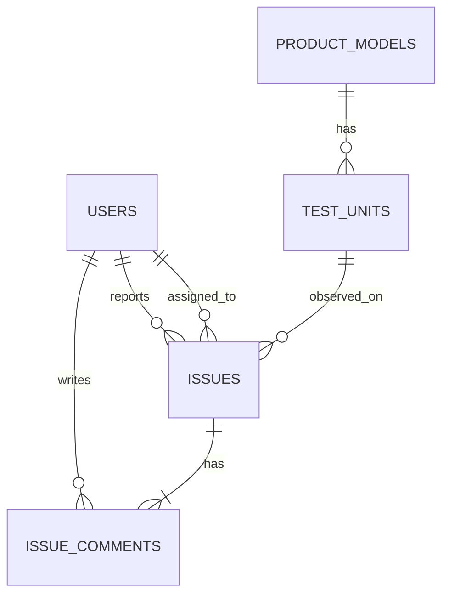
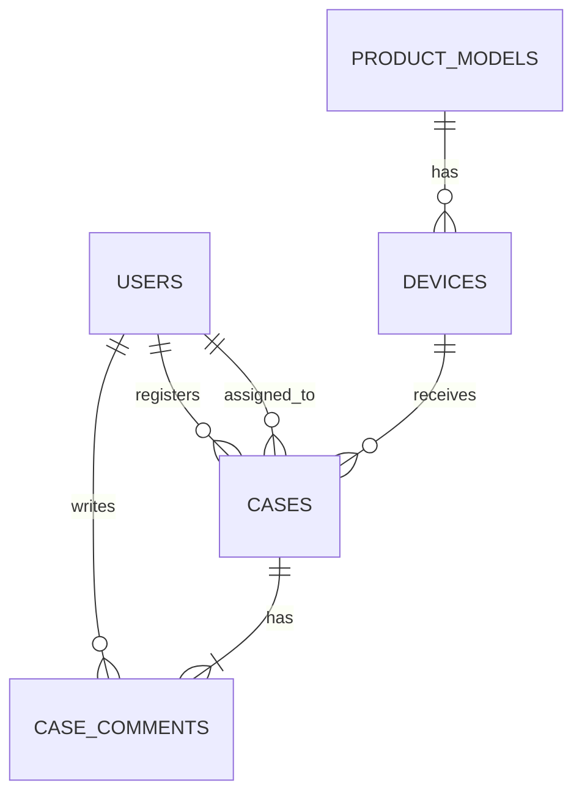

# 첫 오픈 예제 데이터와 검증 질문

Status: 현재 ADR 0025 static two-source launch dataset

이 문서는 Query Man이 제공하는 두 예제 source의 업무 의미를 설명합니다. API 형식이나 SQL 안전
정책보다 “어떤 데이터가 있고 한 행이 무엇을 뜻하는가”에 집중합니다.

현재 범위는 [ADR 0025](decisions/0025-static-non-rls-first-launch.md)의 단일 replica,
PostgreSQL 18/UTF-8, non-RLS launch profile이며 source authority는
[ADR 0030](decisions/0030-git-reviewed-yaml-source-authority.md)의 Git YAML입니다.

## 먼저 알아둘 말

| 용어 | 이 문서에서의 뜻 |
|---|---|
| View | Query Man reader에게 공개한 `ai` schema의 읽기 전용 조회 창구 |
| Grain | 한 행이 나타내는 단위. 예: 문제 한 건, 댓글 한 건, 기기 한 대 |
| Fanout | 다른 grain을 잘못 join해 같은 사실이 여러 번 복제되는 문제 |
| Seed | 다시 실행해도 같은 결과를 만드는 예제 데이터 |
| Golden question | 제품 변경 뒤에도 같은 의미와 결과를 유지해야 하는 대표 질문 |

더 많은 용어는 [공통 용어 사전](glossary.md)을 참고하세요.

## 두 source 한눈에 보기

| Source ID | Database | 무엇을 담는가 |
|---|---|---|
| `development-issues` | `development_issues` | 개발·검증 과정의 문제, 원인, 대책과 댓글 |
| `market-voc` | `market_voc` | 시장 VOC, 제품·시리얼·HW/SW version과 처리 이력 |

Query 한 번은 source 하나만 조회합니다. 두 database를 한 SQL로 join하지 않습니다.

## 개발 문제 데이터



원본 schema는 `development`이고 Query Man reader에는 다음 view만 공개합니다.

| View | 한 행의 의미 | 주로 답하는 질문 |
|---|---|---|
| `ai.issue_overview` | 개발 문제 한 건 | 기간·모델·심각도별 문제, 원인과 대책 |
| `ai.issue_comments` | 댓글 한 건 | 댓글 내용, 작성자와 시각 |
| `ai.test_unit_overview` | 시험기 한 대 | 문제가 없는 시험기를 포함한 전체 시험기 수 |

Seed 규모:

- 사용자 18명
- 제품 모델 6개
- 시험기 160대
- 개발 문제 600건
- 댓글 1,500건

모든 문제에는 댓글이 1~4개 있습니다. 아직 분석하지 않은 문제의 원인과 대책은 `NULL`입니다.

## 시장 VOC 데이터



원본 schema는 `voc`이고 Query Man reader에는 다음 view만 공개합니다.

| View | 한 행의 의미 | 주로 답하는 질문 |
|---|---|---|
| `ai.voc_overview` | VOC 한 건 | 기간·제품·지역·상태별 VOC와 원인·대응 |
| `ai.voc_comments` | 댓글 한 건 | 내부·고객 공개 댓글과 작성자 |
| `ai.device_overview` | 판매 기기 한 대 | VOC가 없는 기기를 포함한 전체 기기 수 |

Seed 규모:

- 사용자 24명
- 제품 모델 8개
- 판매 기기 400대
- VOC 1,200건
- 댓글 3,000건

검증할 수 있도록 다음 패턴을 의도적으로 넣었습니다.

- VOC가 없는 기기 40대
- 힌지 VOC는 `NURI` 제품군에만 존재
- `BORA-LITE-1`의 특정 제조 lot에 배터리·과열 사례 집중
- 최근 접수 건일수록 미해결 상태 비율이 높음
- 같은 사용자 table을 reporter, assignee, comment author 역할로 각각 참조

## View를 여러 개로 나눈 이유

문제와 댓글을 평평한 view 하나로 합치면 문제 한 건이 댓글 수만큼 반복됩니다. 그 상태에서 문제
수를 세면 실제보다 많아지는 fanout 오류가 생깁니다.

```text
issue_overview       = 문제 한 건
issue_comments       = 댓글 한 건
test_unit_overview   = 시험기 한 대

voc_overview         = VOC 한 건
voc_comments         = 댓글 한 건
device_overview      = 판매 기기 한 대
```

예를 들어 “전체 기기 수와 VOC 수”는 `device_overview`에서 답하고, 댓글 본문이 필요할 때만
`voc_comments`를 사용합니다. 서로 다른 grain을 결합해야 하면 각각 먼저 집계한 뒤 join합니다.

이 의미는 DB comment와 semantic overlay에 기록됩니다. `get_context`는 질문과 관련된 view와
column만 골라 제공합니다.

## 아홉 가지 Golden Questions

Development issues:

1. 최근 90일 동안 모델별 개발 문제 건수와 미해결 건수를 보여줘.
2. 원인이 아직 입력되지 않은 Critical 또는 High 문제를 찾아줘.
3. 사용자별 등록 문제 수, 담당 문제 수와 작성 댓글 수를 비교해줘.
4. HW/SW version 조합별로 가장 많이 발생한 문제 유형은 무엇인가?

Market VOC:

1. 모델별 기기 수, VOC 수와 기기당 VOC 수를 높은 순서로 보여줘.
2. VOC가 한 번도 없는 기기는 몇 대인가?
3. NURI 세대별 힌지 VOC 수를 비교해줘.
4. 제조 lot별 전체 VOC 중 배터리 및 과열 VOC 비율을 비교해줘.
5. 지역과 월별 미해결 VOC 추이를 보여줘.

각 질문의 SQL, relation과 예상 결과는
[`config/verified-queries.yaml`](../config/verified-queries.yaml)에 있습니다. 이것은 사용자가 실행할 수
있는 SQL 허용 목록이 아니라 변경 뒤 결과가 달라지지 않았는지 확인하는 회귀 시험입니다.

## 직접 확인하기

처음 실행하는 절차는 [프로젝트 README](../README.md#5분-로컬-실행)를 따릅니다. Database와
application이 준비된 뒤 아홉 질문의 exact revision·column·row·hash를 확인하려면 실행합니다.

```bash
uv run query-man-verify
```

Fixture 자체의 row 수, 의미 분포, view metadata와 reader 권한까지 다시 적용·검사하려면 다음을
사용합니다.

```bash
test -f .env || cp .env.fixture.example .env
docker compose up -d --wait postgres
./scripts/apply-db.sh
```

`apply-db.sh`는 현재 Git YAML inventory의 두 source fixture만 준비합니다. Source 추가나 definition
변경은 별도 YAML review, traffic-off 검증과 배포 승인을 거칩니다.

## 안전 정책은 어디서 보나

이 문서는 데이터 설명만 담당합니다.

- 현재 source, PostgreSQL·RLS·결과 type 제한: [ADR 0025](decisions/0025-static-non-rls-first-launch.md)
- SQL 검사와 실행: [Guarded Query module](modules/guarded-query/README.md)
- HTTP/MCP 외부 API: [Delivery module](modules/delivery/README.md)
- Verified result 검사: [Assurance module의 verified-query 절](modules/assurance/README.md#verified-query-회귀검사)

## MVP Exit Criteria

두 source, 최소 권한 reader, 결정적 seed, grain별 curated view, metadata retrieval, guarded query,
HTTP/MCP와 아홉 verified question의 repository 구현은 완료됐습니다. 현재 검증 방법과 삭제한 과거
기록은 [검증과 Git 기록](verification/README.md)에서 확인합니다. 실제 환경 전환 완료를 뜻하지는
않습니다.
